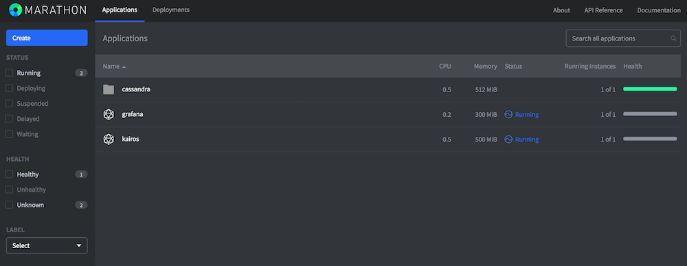
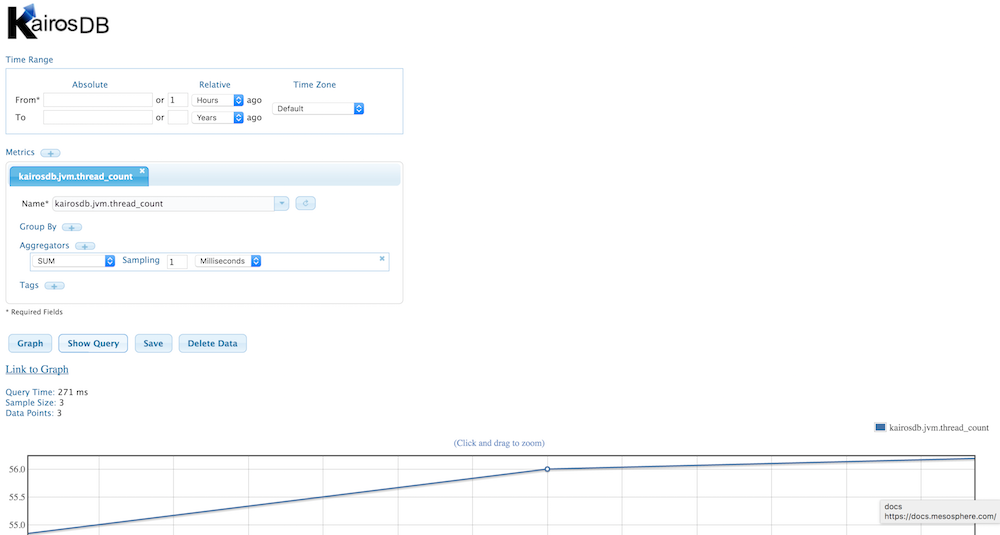
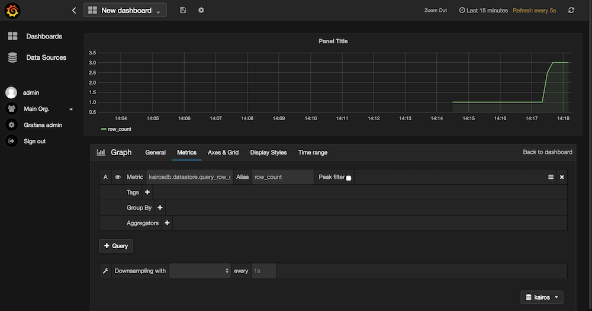

# DCOS KairosDB Tutorial

A time series data processing tutorial on using KairosDB and Cassandra on DCOS.

## Preparation 

- Create a [DCOS cluster](https://mesosphere.com/product/)
- Install [Cassandra](https://docs.mesosphere.com/manage-service/cassandra/)

## Manually launching KairosDB

Using [mesosphere/docker-archlinux-kairosdb](https://github.com/mesosphere/docker-archlinux-kairosdb/) via `docker run` on the DCOS Master node:

    $ ssh -A core@54.69.109.145 
    core@ip-10-0-6-244 ~ $ docker run -P -e "CASS_HOSTS=cassandra-dcos-node.cassandra.dcos.mesos:9160" -e "REPFACTOR=1" mesosphere/archlinux-kairosdb:master
    - env ------------------------------------------------------------------
    CASS_HOSTS=cassandra-dcos-node.cassandra.dcos.mesos:9160
    HOME=/
    HOSTNAME=ed1df85ad35c
    JAVA_HOME=/opt/java
    PATH=/usr/local/sbin:/usr/local/bin:/usr/sbin:/usr/bin:/sbin:/bin:/opt/java/bin
    PORT_CARBON_PICKLE=2004
    PORT_CARBON_TEXT=2003
    PORT_HTTP=8080
    PORT_TELNET=4242
    PWD=/
    READ_CONSISTENCY_DATA=ONE
    READ_CONSISTENCY_INDEX=QUORUM
    REPFACTOR=1
    SHLVL=1
    WRITE_CONSISTENCY_DATA=QUORUM
    _=/usr/sbin/env
    ...
    16:52:01.415 [main] DEBUG [AbstractLifeCycle.java:172] - STARTED SelectChannelConnector@0.0.0.0:8080
    16:52:01.415 [main] DEBUG [AbstractLifeCycle.java:172] - STARTED org.eclipse.jetty.server.Server@2d854f2f
    16:52:01.415 [main] INFO  [Main.java:306] - ------------------------------------------
    16:52:01.415 [main] INFO  [Main.java:307] -      KairosDB service started
    16:52:01.416 [main] INFO  [Main.java:308] - ------------------------------------------

Execute a CQL query in a new terminal:

    $ ssh -A core@54.69.109.145
    core@ip-10-0-6-244 ~ $ docker run -i -t --net=host --entrypoint=/usr/bin/cqlsh spotify/cassandra -e "SELECT * FROM system.schema_keyspaces ;" cassandra-dcos-node.cassandra.dcos.mesos 9160
     keyspace_name | durable_writes | strategy_class                              | strategy_options
    ---------------+----------------+---------------------------------------------+----------------------------
          kairosdb |           True | org.apache.cassandra.locator.SimpleStrategy | {"replication_factor":"1"}
            system |           True |  org.apache.cassandra.locator.LocalStrategy |                         {}
     system_traces |           True | org.apache.cassandra.locator.SimpleStrategy | {"replication_factor":"2"}
    core@ip-10-0-6-244 ~ $ docker run -i -t --net=host --entrypoint=/usr/bin/cqlsh spotify/cassandra -e "SELECT * FROM system.schema_columns ;" cassandra-dcos-node.cassandra.dcos.mesos 9160
     keyspace_name | columnfamily_name       | column_name                 | component_index | index_name | index_options | index_type | type           | validator
     ---------------+-------------------------+-----------------------------+-----------------+------------+---------------+------------+----------------+-----------------------------------------------------------------------------------------------------------------------------
           kairosdb |             data_points |                     column1 |            null |       null |          null |       null | clustering_key |                                                                                   org.apache.cassandra.db.marshal.BytesType
           kairosdb |             data_points |                         key |            null |       null |          null |       null |  partition_key |                                                                                   org.apache.cassandra.db.marshal.BytesType
           kairosdb |             data_points |                       value |            null |       null |          null |       null |  compact_value |                                                                                   org.apache.cassandra.db.marshal.BytesType
           kairosdb |           row_key_index |                     column1 |            null |       null |          null |       null | clustering_key |                                                                                   org.apache.cassandra.db.marshal.BytesType
           kairosdb |           row_key_index |                         key |            null |       null |          null |       null |  partition_key |                                                                                   org.apache.cassandra.db.marshal.BytesType
           kairosdb |           row_key_index |                       value |            null |       null |          null |       null |  compact_value |                                                                                   org.apache.cassandra.db.marshal.BytesType
           kairosdb |            string_index |                     column1 |            null |       null |          null |       null | clustering_key |                                                                                    org.apache.cassandra.db.marshal.UTF8Type
           kairosdb |            string_index |                         key |            null |       null |          null |       null |  partition_key |                                                                                   org.apache.cassandra.db.marshal.BytesType
           kairosdb |            string_index |                       value |            null |       null |          null |       null |  compact_value |                                                                                   org.apache.cassandra.db.marshal.BytesType

Interacting with the KairosDB HTTP API:

    core@ip-10-0-6-244 ~ $ docker ps
    CONTAINER ID        IMAGE                                  COMMAND                CREATED             STATUS              PORTS                                                                                                NAMES
    ed1df85ad35c        mesosphere/archlinux-kairosdb:master   "/usr/bin/runKairos.   29 minutes ago      Up 29 minutes       0.0.0.0:32771->2003/tcp, 0.0.0.0:32770->2004/tcp, 0.0.0.0:32769->4242/tcp, 0.0.0.0:32768->8080/tcp   goofy_bell

Noting down the port `32768` since that's the KairosDB HTTP API:

    core@ip-10-0-6-244 ~ $ curl http://127.0.0.1:32768/api/v1/version
    {"version": "KairosDB 1.1.1-1.20151207194217"}

Remove the KairosDB data from Cassandra:

    $ ssh -A core@54.69.109.145
    core@ip-10-0-6-244 ~ $ docker run -i -t --net=host --entrypoint=/usr/bin/cqlsh spotify/cassandra -e "DROP KEYSPACE kairosdb ;" cassandra-dcos-node.cassandra.dcos.mesos 9160

## Marathon-based deployment

Using Docker images with Marathon we will deploy KairosDB and Grafana, yielding:

### Launching KairosDB 

Use the DCOS command line interface to launch the [Marathon app spec for KairosDB](marathon-kairosdb.json): 

    $ dcos marathon app add marathon-kairosdb.json

Note: on the KairosDB internal port 8080 both the Web UI and also the HTTP interface are exposed (look up mapped port in Marathon).

### Launching Grafana and connecting to KairosDB

Grafana supports KairosDB as a backend since [v2.1](http://docs.grafana.org/v2.6/datasources/kairosdb/).
Again, use the DCOS command line interface to launch the [Marathon app spec for KairosDB](marathon-grafana.json): 

    $ dcos marathon app add marathon-grafana.json

