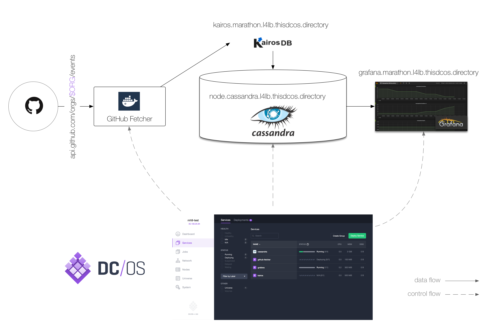
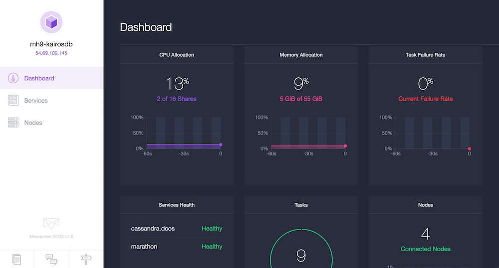
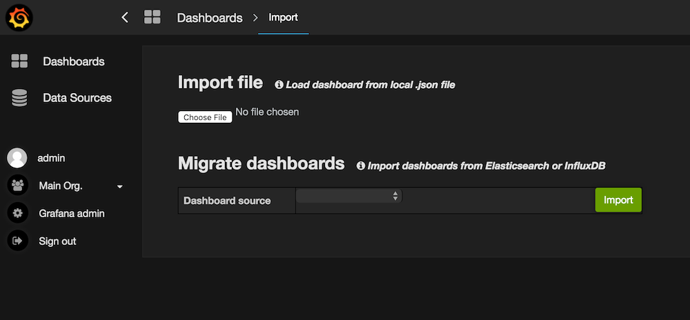
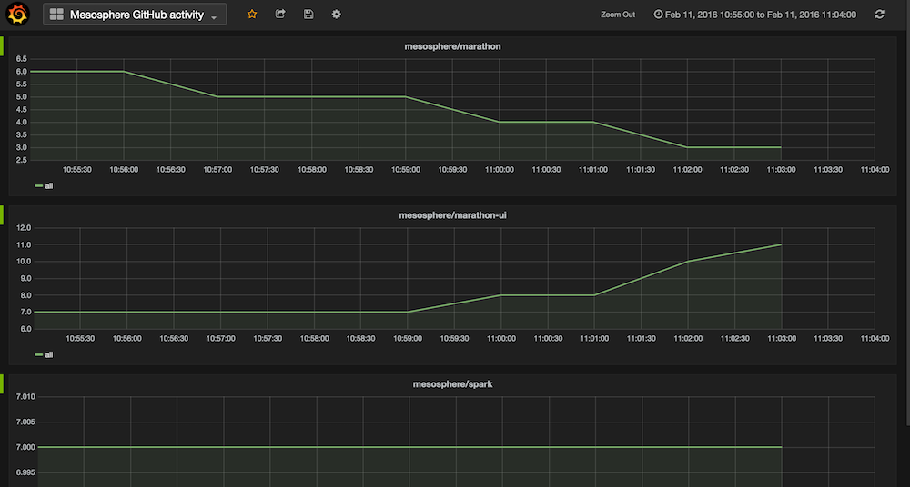

# DCOS KairosDB Tutorial

In this tutorial you'll learn how to set up the time series database [KairosDB](http://kairosdb.github.io/)
along with the popular NoSQL database [Cassandra](http://cassandra.apache.org/) on [DCOS](https://mesosphere.com/product/).
We will use the [GitHub API](https://developer.github.com/v3/) as a stream datasource and build a dashboard
using [Grafana](http://grafana.org/).

The overall application architecture looks as follows: 

Note that above exemplary IP addresses and ports are shown, which varies based on the actual deployment.

## Preparation 

The first step of the preparation is to create a [DCOS cluster](https://mesosphere.com/product/). I've used
a cluster with three private nodes and one public node (where the end-user facing components run):

Once you have the DCOS cluster up and running it's time to install [Cassandra](https://docs.mesosphere.com/manage-service/cassandra/):

    $ dcos package install cassandra

You execute above command from the place where you've installed the [DCOS command line interface](https://docs.mesosphere.com/administration/introcli/).
It takes a couple of minutes and once you see Cassandra marked as healthy in the DCOS dashboard you're good to go.

Note that the Cassandra nodes are (thanks to Mesos-DNS) available via `cassandra-dcos-node.cassandra.dcos.mesos:9160`.

## Deployment

Once you've completed the steps outlined in this section, you should see the following applications and services running in Marathon:

Note that Cassandra has already been launched in the preparation step, so in total three new apps will appear in Marathon.

### Launching KairosDB 

KairosDB is a time series database that runs on top of Cassandra, offering a HTTP data API as well as a Web UI, both exposed via port `8080`.
Use the DCOS CLI to launch the [Marathon app spec for KairosDB](marathon-kairosdb.json): 

    $ dcos marathon app add marathon-kairosdb.json

Note: there is nothing to change for you in `marathon-kairosdb.json`.

Once you see KairosDB running in Marathon, you can access its Web UI by looking up the IP address of the public node (`52.11.127.207` in my case) 
along with the port that Mesos has assigned to the container. You can glean the port mapping information either by looking at the Marathon UI or through using the DCOS CLI like so:

    $ dcos marathon task list
    APP              HEALTHY          STARTED              HOST     ID
    /cassandra/dcos    True   2016-02-09T05:51:45.269Z  10.0.2.113  cassandra_dcos.308b8c24-cef1-11e5-bf2e-02181a13a4a7
    /grafana           True   2016-02-02T13:57:01.932Z  10.0.4.20   grafana.ce2c8b12-c9b4-11e5-bf2e-02181a13a4a7
    /kairos            True   2016-02-02T14:11:48.858Z  10.0.4.20   kairos.ce522993-c9b6-11e5-bf2e-02181a13a4a7
    $ dcos marathon task show kairos.ce522993-c9b6-11e5-bf2e-02181a13a4a7
    {
      "appId": "/kairos",
      "host": "10.0.4.20",
      "id": "kairos.ce522993-c9b6-11e5-bf2e-02181a13a4a7",
      "ipAddresses": [
        {
          "ipAddress": "172.17.0.2",
          "protocol": "IPv4"
        }
      ],
      "ports": [
        24653,
        24654,
        24655,
        24656
      ],
    ...

Use the first port (since that's the mapped container port `8080`), which for me is `24653` and together with the public node IP 
you can visit the KairosDB Web UI now:

Even now, without any data ingested from GitHub, you can toy around with the internal metrics available. Also, if you're interested in 
the internals of KairosDB on DCOS, check out the [manual launch notes](manual-launch.md).

### Launching Grafana

We want to build a dashboard with Grafana, plotting the time series data from KairosDB. For that we need to launch Grafana first:

    $ dcos marathon app add marathon-grafana.json
    
Note: again, as in the previous step, there is nothing to change for you in `marathon-grafana.json` and you can look up the port
it is serving on in the same fashion (for me that was `52.11.127.207:30786`).

Next step is to connect Grafana to KairosDB as a backend, which is supported since [v2.1](http://docs.grafana.org/v2.6/datasources/kairosdb/).
You do this by adding a new data source as shown below:

Once you've completed this step you're almost good to go.

### Getting data from GitHub

To ingest data from GitHub into KairosDB, a custom Docker image is used, called the [GitHub Fetcher](/github-fetcher).
In a nutshell, it polls `https://api.github.com/orgs/$ORG/events` with a configurable time interval and uses the KairosDB HTTP API
to ingest the datapoints. 

The custom Docker images is launched as a Marathon app via the app specification [marathon-github-fetcher.json](marathon-github-fetcher.json).
There is one parameter in `marathon-github-fetcher.json` that you **must** adapt, based on your deployment, and that is `KAIROSDB_API` 
(which is the same IP/port as we've established earlier for the KairosDB WebUI):

    ...
    "env": {
        "KAIROSDB_API": "http://52.11.127.207:24653",
        "GITHUB_ORG": "mesosphere",
        "POLL_INTERVAL": "60"
    },
    ...

Note: if you want to watch a different organization, you can change the value of `GITHUB_ORG` and if you want to have a different
poll frequency, `POLL_INTERVAL` is the place to do this (by default set to 60 sec, which is a good value for most organizations).

## Usage

Once you've gone through the preparation steps and launched both KairosDB and Grafana as well as configured the GitHub fetcher as
discussed in the previous section, you're ready to produce some output.

First, launch the GitHub Fetcher and make sure it is running:

    $ dcos marathon app add marathon-github-fetcher.json

Now, data is ingested from the GitHub API into Cassandra and available in Grafana. You can either create your own dashboards or import
the one I've created, [grafana-dashboard.json](grafana-dashboard.json), as a starting point and take it from there, like so:

The result of the import is the GitHub activity of an organization:

Note that you can play around with the tags to show a drilldown in terms of activities (such as pull requests, comments, etc.) and actors (GitHub users).

